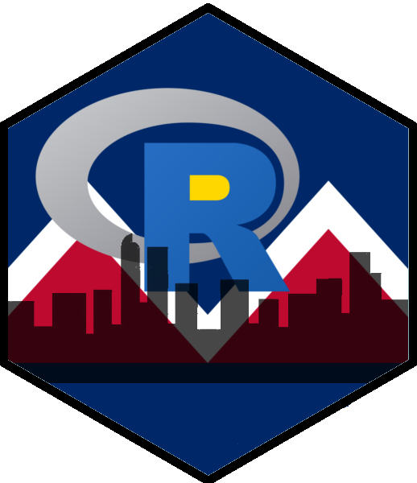

Denver R User Group 
================================================================================

https://www.meetup.com/DenverRUG/

Our meetup is designed to bring together all of the R users along the Front
Range of Colorado. We welcome R newbies as well as the experience hacker. All
backgrounds are encouraged to join the group -- life sciences, social sciences,
etc.

## Upcoming Meetups
Please refer to the [meetup page](https://www.meetup.com/DenverRUG) for upcoming meetups.

## Past Meetups

|      | Date         | Topic                                                                                          |
| :--- | :----------- | :--------------------------------------------------------------------------------------------- |
| 2019 | November  19 | [Reactivity in Shiny Aps](#2019-november-19)                                                   |
|      | October   22 | [Two talks: 1. regexp; 2. larger than memory data packages](#2019-october-22)                  |
|      | September 24 | [Propensity Score Methods](#2019-september-24)                                                 |
|      | August     6 | [Quantified Self: R tools for the analysis of personal data to improve health](#2019-august-6) |
|      | June      25 | [Sparklyr: Connecting R and Apache Spark](#2019-june-25)                                       |
|      | April     23 | [knitr::spin -- A more dynamic approach to dynamic documents](#2019-april-23)                  |
| 2018 | November  13 | [Two Talks: 1. Natural Language Processing (NLP); 2. Spark and Sparklyr](#2018-november-13)    |
|      | October    9 | [Two Talks: 1. R + TensorFlow: GPU-Accelerated Computing; 2. data.table](#2018-october-9)      |
|      | September 11 | [Two Talks: 1. Causal Inference; 2.  ggogleVis](#2018-september-11)                            |
|      | February  13 | [R packages development](#2018-february-13)                                                    |
|      | January   10 | [R Basics](#2018-january-10)                                                                   |
| 2017 | December  13 | [Topic TBA](#2017-december-13)                                                                 |
|      | November   8 | [Two Talks: 1. Webscraping in R; 2. Accessing databases](#2017-november-8)                     |
|      | October   11 | [Lightning Talks](#2017-october-11)                                                            |
|      | August    10 | [kerasR: building neural networks (deep and otherwise) in R using keras)](#2017-august-10)     |
|      | June      28 | [Introduction to the CPR package and Programmatic Construciton of Calls](#2017-june-28)        |
|      | March     28 | [RStudio Tidyverse](#2017-march-28)                                                            |
|      | February  20 | [Dave Robinson on tidytext](#2017-february-20) |
| 2016 | September 29 | [Webinar on Data Loading](#2016-september-29) |
|      | September 24 | [Live Classes on Apache Spark and Scala](#2016-september-24) |
|      | September 22 | [Live Led-Online Webinar: Apache Spark and Scala](#2016-september-22) |
|      | September 17 | [Live Led-Online Webinar: Apache Spark and Scala](#2016-september-17) |
|      | August    31 | [Parallel Computing with R](#2016-august-31) |
|      | June       8 | [Data Visualization](#2016-june-8) |
|      | March     30 | [Lightning Talks](#2016-march-30) |
|      | January   13 | [Shiny and Markdown](#2016-january-13) |
| 2015 | November  10 | [Office Hours/Caret](#2015-november-10) |
|      | September 23 | [Operationalizing R with Azure Machine Learning / EBH Update](#2015-september-23) |
|      | August     6 | [The sqldf package and making a new career in data analytics](#2015-august-6) |
|      | June      18 | [Building Packages in R - a couple options](#2015-june-18) |
|      | April     16 | [Websites with Github & Rstudio/Continuous Delivery Systems](#2015-april-16) |
|      | March     31 | [Agile and other Programming Practices](#2015-march-31) |
|      | January    6 | [RRO - Revolution's new enhanced open source distribution](#2015-january-6) |
| 2014 | December  18 | [Holiday Happy Hour and Dinner](#2014-december-18) |
|      | November  18 | [testit, testthat and/or testing in general](#2014-november-18) |
|      | August     5 | [Creating and approachable data product with R using shiny and rCharts / Plus +](#2014-august-5) |
|      | July       1 | [dplyr: the next iteration of plyr](#2014-july-1) |

### 2019 November 19

**Reactivity in Shiny Aps**

Kyle Bartsch, @kbartsch, presented on the various ways to configure and debug
reactivity in Shiny apps, from simple user input to dynamic user interaction
with data tables and plots.

* [Slides and Examples](https://github.com/DenverRUG/2019-11-19-DRUG-Shiny-Demos)
* [Meetup Event](https://www.meetup.com/DenverRUG/events/265318284/)

### 2019 October 22

**Two Talks**

1. Matt Pocernich, @mjpdenver, presented on regular expressions, grep, and
   sub in R.

2. Peter DeWitt, @dewittpe, presented on building and using R data packages
   for data sets which are larger than memory. Applications for this type of
   work can include large static data sets and/or collaboration when a central
   data base is not an option.

   * [Slides and Examples](https://github.com/DenverRUG/2019-10-22-R-data-pkgs)

* [Meetup Event](https://www.meetup.com/DenverRUG/events/265318268/)

### 2019 September 24

**Propensity Score Methods**

Office Hours (minutes). Want to pose a question to the group that can be
addressed in a few minutes? Please do.

Propensity Score Methods using R. (Matt Pocernich at Oracle Data Cloud)

With a brief overview of the concepts behind propensity scores methods, this
talk will look at several R packages, such as hdPS, twang and Zelig, focusing on
twang (Toolkit for weighting and analysis of non-equivalent groups ) . This talk
was inspired by the Advanced Topics in Propensity Score Methods workshop by Wei
Pan, Duke University; Haiyan Bai, University of Central Florida taught at this
year’s JSM.

magrittr : A basic introduction to the piping operators provided by the
magrittr. (Also by Matt Pocernich - unless someone else would like to speak on
this topic. )

### 2019 August 6

**Quantified Self: R tools for the analysis of personal data to improve health**

https://www.meetup.com/DenverRUG/events/263490698/

JP Snow will be presenting.

*Abstract*

"Quantified Self" involves tracking personal data to improve fitness,
health and personal performance. The data and analytic packages available
in R make personal quantification even more valuable. Participants in this
session will learn how to create a personal dashboard and see how how
machine learning can be used to determine optimal sleep factors, all via R.
Other concepts to be covered will include:
- Flexdashboard package for dashboard development
- ggplot techniques, including ggplotly for more interactivity
- Accessing personal data directly from R into Fitbit’s web API
- Using scatter charts, box plots and decision tree methods for analysis

JP Snow has been involved in analytics roles in financial services
throughout his twenty-year career. He currently leads Institutional
Analytics & Client Loyalty at Charles Schwab. A few years ago he started
tracking fitness metrics and realized R had substantial advantages over
Excel. He also leads the Denver Quantified Self Meet-Up group.

* [Meetup Event](https://www.meetup.com/DenverRUG/events/263490698/)

### 2019 June 25

**Sparklyr: Connecting R and Apache Spark**

Ben Hoffman will be presenting an introduction to Sparklyr, an R package to
working with Apache Spark. Do you have data that is too big to fit into memory?
Spark will let you work in memory or on disk, cache tables in memory, and use
machine learning libraries on data that is too big to fit into memory!

* [Slides and Examples](https://github.com/DenverRUG/2019-06-25-Sparklyr)
* [Meetup Event](https://www.meetup.com/DenverRUG/events/262309100/)

### 2019 April 23

**knitr::spin -- A more dynamic approach to dynamic documents**

Building dynamic documents via literate programming is a critical part of
responsible and reproducible science. Built on a literature programming
framework, authoring .Rmd, .Rnw, .Rhtml, or other files, uses a markup language
(markdown, LaTeX, html, ...) as the primary language for the file and the
analysis/programming language (R, C++, SAS, ...) is a guest language. This
paradigm has been extremely useful and durable since its formal introduction in
the book "Literate Programming" Donald Knuth in 1984. R users should be at least
aware of Sweave and knitr::knit, two R focused literate programming tools.

However, the common method of literate programming is, from the perspective of
an analysis, backwards. As an analysis my primary language is the analysis
language and the human readable report is nothing more than detailed code
comments about the analysis script(s). knitr::spin is the tool needed to use
literate programming paradigms where the analysis language is the primary
language for the file(s) and the markup language is the guest language.

This talk will cover the following:

1. Introduction to knitr::spin -- concept and syntax
2. Simple reports -- that is analysis.R --> analysis.(docx|html|pdf)
3. Non-trivial reports -- child documents and conditional code evaluation

* [Slides and Examples](https://github.com/DenverRUG/2019-04-23-spin)
* [Meetup Event](https://www.meetup.com/DenverRUG/events/260632409/)

### 2018 November 13

**Natural Language Processing (NLP) / Spark and Sparklyr**

1. You down with NLP? (yeah you know me) Richard Vlasimsky with IMIDEX will
   demonstrate some basic natural language processing concepts and techniques in
   R using data from the Open Lyrics database on Github.

2. Spark and sparklyr  Sean Lopp from Rstudio will go through how to get
   started with Spark and sparklyr. We'll also discuss what Spark is and where
   its used, and demo examples of data wrangling, machine learning, and spark
   streaming.

* [Meetup Event](https://www.meetup.com/DenverRUG/events/255628505/)

### 2018 October 9
Two talks:

**R + TensorFlow: GPU-Accelerated Computing in the Age of Deep Learning**
by Matt Hergott

Today’s complex neural networks and large data sets make it difficult or
impossible to solve problems with traditional computational methods. This talk
will focus on how we can use R with TensorFlow and graphics processing units
(GPUs) to achieve our goals in a dramatically accelerated fashion.

Topics covered include: What is GPU computing? Why do we use libraries like
TensorFlow? What is the relationship between TensorFlow and Keras? What does an
R + TensorFlow program look like?

Matt Hergott focuses on traditional econometric analysis, deep learning
architectures, and complex quantitative visualizations through his firm MiaBella
AI. His GPU programming experience includes the emerging field of 3D holograms,
and a statistical visualization package he wrote made Microsoft’s top-16 list of
“noteworthy HoloLens content.”

**data.table package**

by David Heisler

This talk provides an overview of the data.table package including a brief
history of data.table, basic and some advance syntax and a comparison with
dplyr.

* [Meetup Event](https://www.meetup.com/DenverRUG/events/255157224/)

### 2018 September 11
Two talks:

**CausalImpact Package**
Karen Kazor - Oracle Data Cloud

CausalImpact is a package contributed by the folks at Google to estimate the
effect of a treatment or intervention on a individuals observed over time. In
online advertising a common example is estimating additional clicks or other
actions attributed to a campaign. Karen will discuss some of the ins and outs of
this package.

**Hans Rosling - Truthfulness and googleVis**
Matt Pocernich - Oracle Data Cloud

Inspired by Hans Rosling's book - Factfulness, I will re-visit the googleVis
package which was inspired by the very cool animated plots used in his 2006 Ted
Talk. This talk will illustrate some the topics from recent book using goolevis
and ggplot.

Question for discussion: When and why do you use R Notebooks in lieu of
traditional Markdown documents?

* [Meetup Event](https://www.meetup.com/DenverRUG/events/253570063/)

### 2018 February 13

**R package development**

Peter DeWitt will be presenting. The focus will be on reproducible reporting,
documenting, and collaboration. The presentation will first show that relying on
a script is insufficient for sharing code and having reproducible results. The
movement from `important-analysis.R` script to an R package will be shown.

Expanding on the R package structure, Peter will provide examples of when
version control and continuous integration tools not only provide for higher
quality documentation and work, but can be essential for keeping each developer
on a team accountable.

We will cover SVN and Git log and blame. Using the testthat package, and using
CI.

* [Slides and Examples](https://github.com/DenverRUG/2018-02-13-pkgstr-and-ci)
* [Meetup Event](https://www.meetup.com/DenverRUG/events/246924064/)

### 2018 January 10

Three talks on R Basics

These talks provide a brief overview of topics needed to you going using R. Each
talk will be about 20 minutes. While the talks are aimed users new to R -
everyone is welcome and there are always new tricks to learn. Talks will begin
at 7:30.

1. **Loading and writing Data** - Steve Sullivan
   - save, load
   - read.table, write.table
   - read.csv, write.csv
   - readLines
   - readline
   - Only mention: readChar, writeChar, readBin, writeBin
   - scan
   - cat==write, paste, sprintf
   - plots: ggsave, png, pdf
   - Briefly mention packages: jsonlite, yaml, RSQLite, RMySQL, RPostgreSQL
   - Resources ...

2. **dplyr** - Andy Pickering
   - piping
   - The 5 main verbs of dplyr and examples usingdata frames
   - What the equivalent functions would be in SQL and/or base R
   - Introduction to the pipe and chaining operations.
   - Group-by operations and pipe examples.

3. **ggplot2** - Leila Afzali - Data Scientist
   - What is ggplot2 and components of a ggplot2 plot
   - Briefly discussing installing and loading the package
   - Go over example(s) showing the usage of ggplot2 for EDA, model diagnostics
     and result of analysis

* [Meetup Event](https://www.meetup.com/DenverRUG/events/243291958/)

### 2017 December 13
Topic TBA -- Meetup didn't happen.

### 2017 November 8

Two Talks:

**Webscraping**

Ryan Elmore will introduce an newish R package (ballr, pronounced baller) for
scraping data from basketball-reference.com (http://basketball-reference.com/).
He will highlight the use of the rvest package, along with the selectorgadget
tool. He would love it if others are interested in contributing to this project!

* [ballr on cran](https://cran.r-project.org/package=ballr)
* [ballr on github](https://github.com/rtelmore/ballr)

**Databases in R**

Matt Pocernich will discuss accessing databases in R. This introductory talk
will focus on accessing data using a functions found in RODBC, touch a little on
dplyr, but then show how dbplyr extends dplyr to access databases.

* [Meetup Event](https://www.meetup.com/DenverRUG/events/243291900/)

### 2017 October 11

1. Danny Inman - NREL
   - Using R for selecting efficient production frontiers for local sensitivity
     analysis.

1. Sean Lopps - Rstudio
   - Group Choice (pick one) 1. RStudio 1.1 Updates (List Viewer, Databases,
     Terminals) 2. Turning R code into RESTful APIs 3. Intro to testthat

1. Andy Pickering
   - Have you every found yourself saying "It seems hotter/colder than normal
     lately"? I do all the time (maybe I just really like weather). Now you can
     check the data yourself with the WeatherComparer Shiny App. I'll show the
     app and talk a little about some issues I encountered when making it.

1. Laura Kinney Metro State
   - discusses analyzing survey results using the tidytext package and built a
     shiny app evaluating Likert scale questions to measure the effectiveness of
     the Colorado Youth at Risk program.

1. Peter DeWitt - Neptune
   - A quick talk about Non Standard Evaluation with dplyr and how to move away
     from the (depreciated) select_, mutate_, filter_, .... functions.
   - [Slides and Examples](https://github.com/DenverRUG/2017-10-11-non-standard-eval)

1. Ed Wolfrum - NREL
   - Ed has been using RMarkdown to simplify reporting of data in standard
     formats from multiple Excel files which contain different types of
     analytical chemistry data that must be combined and summarized before being
     reported out. In this lightning talk, Ed will talk about what he has
     learned about using RMarkdown, and also ask for advice in improving the
     current workflow.

1. Taylor Larsen is a Data Science Engineer at Health Catalyst and is part of the team responsible for healthcareai
   - healthcareai is an open source machine learning package developed with
     healthcare use cases in mind. We'll do a quick overview of healthcareai's
     current features, implemented use cases, and the community behind the
     package.

* [Meetup Event](https://www.meetup.com/DenverRUG/events/243291874/)

### 2017 August 10

**kerasR: building neural networks (deep and otherwise) in R using keras**

Barton Rhodes will be presenting.

A simple walk-through of creating a convolutional neural network to recognize
handwritten digits. Examples based on the MNIST and/or notMNIST data sets.

Everyone is welcome to come around 7:00pm and socialize. Barton's talk will
start around 7:30pm. After the talk we may walk over to Cap City Tavern for food
and drinks.

* [Slides and Examples](https://github.com/DenverRUG/2017-08-10-keras/tree/master/2017-08-10-keras)
* [Video of the talk](https://vimeo.com/229361206)
* [Meetup Event](https://www.meetup.com/DenverRUG/events/241913353/)

### 2017 June 28

**Introduction to the CPR package and Programmatic Construciton of Calls**

Peter DeWitt will be presenting two topics.

First, the cpr (control polygon reduction) R package will be introduced. The cpr
package provides a set of tools for working with uni- and multi-variable
B-splines, and most importantly, efficiently finding parsimonious B-spline
regression models with high quality of fit.

You can get the cpr package from
https://cran.r-project.org/package=cpr
or
https://github.com/dewittpe/cpr/

Discussion of the implementation of the CPR algorithm within the cpr package
segues into the second topic, programmatic construction and evaluation of calls
within R. This will highlight

* match.fun()
* stats::update()
* formulas, and
* Environments.

Peter will start his talk around 7:30pm. We'll use the time between 7:00pm and
7:30pm to socialize and answer generic R questions. After the talk there is
usually a small group who will head out for a beer and burger. Hope to see you
at Galvanize.

* [Slides and Examples](https://github.com/DenverRUG/2017-06-28-cpr)
* [Meetup Event](https://www.meetup.com/DenverRUG/events/240713454/)

### 2017 March 28

**RStudio Tidyverse**

Speakers : Sean Lopp and friends from Rstudio

At RStudio we think about a model for data science that begins with importing
and tidying data, continues with an iterative cycle of transforming, modelling,
and visualizing data, and ends with communicating results. We've built tools and
packages to help you succeed across this cycle: RStudio and Notebooks for
interactive development, the Tidyverse for making data science easier and more
effective, and R Markdown, Shiny, and the new RStudio Connect (Pro) for
communicating results. In this talk we'll share the way we think about data
science and our toolchain.

Refreshments kindly provided by Rstudio

All of the slides and demos are available at: https://github.com/rstudio/meetup_roadshow

And you can play with the demos at: http://roadshow.rstudio.com

* [Meetup Event](https://www.meetup.com/DenverRUG/events/237419189/)

### 2017 February 20

**Dave Robinson on tidytext**

Title: Tidy Text Mining with R

Abstract: Text data is increasingly important in many domains, but it can be
challenging to manipulate and visualize within typical R analysis workflows. In
this talk, I will introduce the tidytext package and show how tidy data
principles and tools can make text mining easier and more effective, by
structuring text as one-token-per-row. You'll learn how to manipulate,
summarize, and visualize text's characteristics using R packages from the tidy
ecosystem such as dplyr, ggplot2, and tidyr. You'll see case studies of
sentiment analysis, tf-idf, and topic modeling applied to examples from
literature, Twitter, and Stack Overflow questions, and gain the tools to draw
conclusions from your own text datasets.

Bio: David Robinson is a Data Scientist at Stack Overflow, where he analyzes
data on the world's software developers to help them find answers to their
programming questions. He is the co-author with Julia Silge of the tidytext
package and of the upcoming book Text Mining with R, to be published by O'Reilly
in 2017. He is also the author of the broom, gganimate, and fuzzyjoin packages
and of the DataCamp course "Exploratory Data Analysis in R: Case Study." He
writes about R, statistics and education on his blog Variance Explained, as well
as on Twitter as @drob.

* [Meetup Event](https://www.meetup.com/DenverRUG/events/237219350/)

### 2016 September 29

**Attend Free Live Webinar On Data Loading Techniques in Hadoop**

We would like to cordially invite you to DATA LOADING TECHNIQUES IN HADOOP (http://unbouncepages.com/free-webinar-haoop-dataloading/)What you'll Learn:

* INTRODUCTION TO BIG DATA
* CHALLENGES TO BIG DATA
* INTRODUCTION TO HADOOP
* HADOOP CHARACTERISTICS AND HDFS
* DATA LOADING TECHNIQUES

KEY FEATURES OF SPARK:

* FAST ANALYTICS
* REAL-TIME STREAM PROCESSING
* FAULT TOLERANT
* POWERFUL AND INTEGRATED DATA PROCESSING
* EASY TO USE

It is Scheduled for 29th September 2016, Thursday 09:00 PM To 10:00 PM IST.
(http://unbouncepages.com/free-webinar-haoop-dataloading/)

In case you can't make it sign-up anyway, we'll send you the recording.

This promises to be an extremely enriching session and we hope you can make it -Register Now (http://unbouncepages.com/free-webinar-haoop-dataloading/)

If you have any additional questions or require further clarification, please, do not hesitate to Call me on
+91 7022 55 1245 or send me an Email (brajesh@kratoes.com).

* [Meetup Event](https://www.meetup.com/DenverRUG/events/234437955/)

### 2016 September 24

**Live Classes on Apache Spark and Scala (Upgraded by industrial experts)**

We would like to cordially invite you to Apache Spark and Scala Classes (http://unbouncepages.com/apachespark-and-scala-class/)

Featuring 30 Hours of Led-Live Online Training, Advanced Concepts, Practical
Tutorials, Hands-on Practices, Installation Manuals, ClassRecordings, Data Sets,
Real-Time Industry Projects, Vitual Machine Kit, Hadoop Practical Course, 24/7
365 days Support and Certificate !

The Following Topics will be Covered:

* Introduction To Sparks & Scala
* Scala - Essentials And Deep Dive
* Introducing Traits And Oops In Scala
* Functional Programming In Scala
* Spark And Big Data
* Understanding RDDs
* Spark Sql
* Advanced Spark Concepts And Project Discussion

It is Scheduled for 24th September - 30th October, 2016 10:30 AM to 01:30 PM (EDT); (http://unbouncepages.com/apachespark-and-scala-class/)

Saturday & Sunday (Week-End) Batch

In case you can't make it sign-up anyway, we'll send you the recording.

This promises to be an extremely enriching session and we hope you can make it -Register Now (http://unbouncepages.com/apachespark-and-scala-class/)

If you have any additional questions or require further clarification, please, do not hesitate to Call me on
+91 7022 55 1245 or send me an Email (brajesh@kratoes.com).

* [Meetup Event](https://www.meetup.com/DenverRUG/events/234320596/)

### 2016 September 22

**Free Live Led-Online Webinar: Apache Spark and Scala**

We would like to cordially invite you to Free Online Webinar on Apache Spark and Scala (http://unbouncepages.com/apachespark-webinar/).

It is Scheduled on 22nd September 2016, 09:00 PM To 10:00 PM IST.

The Following Topics will be Covered:-

TOPICS:

* INTRODUCTION TO BIG DATA
* INTRODUCTION TO SPARK
* WHY SPARK
* SPARK ECOSYSTEM
* INTRODUCTION TO SCALA
* PRACTICAL'S ON SPARK

KEY FEATURES OF SPARK:

* Fast Analytics
* Real-Time Stream Processing
* Fault Tolerant
* Powerful and Integrated Data Processing
* Easy to use

In case you can't make it sign-up anyway, we'll send you the recording.

This promises to be an extremely enriching session and we hope you can make it -Register Now (http://unbouncepages.com/apachespark-webinar/)

If you have any additional questions or require further clarification, please, do not hesitate to Call me on
+91 7022 55 1245 or send me an Email (brajesh@kratoes.com).

* [Meetup Event](https://www.meetup.com/DenverRUG/events/234268498/)

### 2016 September 17

**Live Led-Online Classes: Apache Spark and Scala (Upgraded by Industrial Expert)**

We would like to cordially invite you to Apache Spark and Scala Classes (http://unbouncepages.com/apache-spark-classes/)

Featuring 30 Hours of Led-Live Online Training, Advanced Concepts, Practical Tutorials, Handson Practices, Installation Manuals, Class Recordings, Data Sets, Real-Time Industry Projects, Spark Practical Kit, 24/7 365 days Support and Certificate !

CLICK HERE TO REGISTER FOR FIRST TWO CLASSES @ $10 USD (http://unbouncepages.com/apache-spark-classes/)

The Following Topics will be Covered:-

* Introduction To Sparks & Scala
* Scala - Essentials And Deep Dive
* Introducing Traits And Oops In Scala
* Functional Programming In Scala
* Spark And Big Data
* Understanding RDDs
* Spark Sql
* Advanced Spark Concepts And Project Discussion

It is Scheduled for 17th September - 09th October, 2016 10:30 AM to 01:30 PM (EDT); (http://unbouncepages.com/apache-spark-classes/)

Saturday & Sunday (Week-End) Batch

In case you can't make it sign-up anyway, we'll send you the recording.

This promises to be an extremely enriching session and we hope you can make it -Register Now (http://unbouncepages.com/apache-spark-classes/)

If you have any additional questions or require further clarification, please, do not hesitate to Call me on
+91 7022 55 1245 or send me an Email (brajesh@kratoes.com).

* [Meetup Event](https://www.meetup.com/DenverRUG/events/234147446/)

### 2016 August 31

**Parallel Computing with R**

1. **SparkR** Jeremy Jackson, a Senior Developer at The Cadmus Group, Inc., will
   talk about using Vagrant to provision a Spark + R + RStudio development
   cluster on a personal computer, some of the more useful analysis features of
   SparkR for parallel computing, and different options for scaling your
   development cluster to the cloud.

1. **GPU Computing in R** A Focus on the gpuR Package Matt Hergott

1. **foreach and rxExec** Michael Helbraun - Revolutions Analytic.  Generally, R
   is in memory and single threaded. To scale to larger data and/or more
   computationally intensive problems parallelization becomes important; this
   talk will mostly cover options for explicit (foreach, rxExec)
   parallelization, but we'll also touch upon some options for implicit
   parallelization as well.

* [Meetup Event](https://www.meetup.com/DenverRUG/events/233224728/)

### 2016 June 8

**Data Visualization**

1. **R Powered Dashboards - within the Microsoft Ecosystem**
   - Phil Wagner - The Cadmus Group
   - As Microsoft integrates R into an increasing number of applications, it
     adds to the ways in which R can be used to simplify data processing and
     sharing… Even within the MS ecosystem. This presentation will show an
     example of using R with Power BI to quickly create and share interactive
     dashboards that visualize key information in real-time.

2. **flexdashboard: Easy interactive dashboards for R**
   - Sean Lopp from R Studio will present on a new package for creating HTML dashboards in R Markdown.
   - flexdashboard
     (https://tracking.cirrusinsight.com/aebd1958-7160-4855-9298-d6fbe43a128e/rmarkdown-rstudio-com-flexdashboard)
     provides a handful of dashboard layouts configured with simple syntax, the
     barrier to entry couldn't be lower!

3. **(Time permitting) The logic behind ggplot2**
   - Matt Pocernich - Oracle
   - Frequently, new users of ggplot2's initial reaction to the package and the
     relatively complex syntax is "WTF?, Why can't I just do whatever I want?"
     This talk briefly looks in to the underlying logic behind ggplot graphics
     as discussed by Wilkinson in The Grammar of Graphics and Wickam's book:
     ggplot2.  Wilkonson introduces the logic and structure behind translating
     mathematical ideas into graphics. This is the rigor behind many of the
     seemingly inflexible features found in ggplot.

* [Meetup Event](https://www.meetup.com/DenverRUG/events/231221482/)

### 2016 March 30

**Lightning Talks**

* A series of short talks about favorite packages and functions. We have several speakers lined up and room for one more.
* Topics and Speakers
  * Kellie Keeling - Visualizing Statistical Results
  * Ed Wolfrum - Clever aggregate()
  * Bruce Bugbee - Time Series and Shiny
  * Peter DeWitt - Formulas and recursion
  * Ryan Elmore - horse racing and handicaps

* [Meetup Event](https://www.meetup.com/DenverRUG/events/229857592/)

### 2016 January 13

**Shiny and Markdown**

Sean Lopp - RStudio

Have you created a great analysis in R but aren't sure how to share it? Looking
for a way to deploy R across your organization? I'll be discussing some of the
recent features of R Markdown (including parameterized reports and embedding
htmlwidgets). I'll also discuss Shiny and the different ways to deploy and scale
Shiny applications (including how to handle applications that rely on
databases). Finally, I'll demo some of the new collaboration features built into
our commercial IDE, and give a sneak peak at an upcoming product: RStudio
Connect.

* [Meetup Event](https://www.meetup.com/DenverRUG/events/227361477/)

### 2015 November 10

**Office Hours/Caret**

Office Hours - 6:30 till 8

This meeting we want to try something different. Come a bit early to ask or
answer R questions. Bring your computers. All questions are welcome. Depending
on the question - individual help might be in order or we can throw the question
out to the group. Normally - these types of discussions happen later - after the
talk or at the bar. At 8 there will be a more formal presentation.

Caret - Classification And REgression Training - Package

by Matt Pocernich

One of R's strengths is that it offers so many options for statistical and
machine learning techniques. As a consequence - it can be difficult to learn,
fairly evaluate and compare different models. The caret package attempts to
address some of these issues by providing a common interface to run over 150
models. Additionally, utilities are provided to partition datasets for use in
cross validation, tune models (if appropriate) and provide neat graphical and
tabular output.

Caret will be run and compare several models to predict outcome using the
Wisconsin Breast Dataset

More information about caret can be found here.
http://topepo.github.io/caret/index.html

* [Meetup Event](https://www.meetup.com/DenverRUG/events/226179728/)

### 2015 September 23

**Operationalizing R with Azure Machine Learning / EBH Update**

Using your R skills you've built a killer predictive model that has the power to
transform your organization and take it to the next level. Now how do you
operationalize that model so it can be integrated with and leveraged by line of
business applications? Meet Microsoft's Azure Machine Learning service. Azure ML
gives R developers and data scientists the ability to perform one click
publishing of their R models and make them available for consumption as simple
REST web services for developers across your organization. You can model, tune,
test, deploy and score unseen data, on-demand without any acquisition or setup
of infrastructure and you only pay for what you use. We'll present how you can
get started using your R skills with this new machine learning service.

Bio

Chris McHenry is a software developer living in the foothills of Colorado. He is
currently the VP of Technology for Integro, an industry leading software and
services provider of Information Governance solutions. His main focus is on the
development of an innovative Information Governance software platform. He leads
a high caliber team of Dev and QA professionals using Scrum, Visual Studio, and
TFS. His current passion (obsession?) is applying Machine Learning technology to
improve the user experience with everyday software applications. He has a
patented design leveraging classification technology with user oversight to
better manage and defensibly dispose of content. His favorite new technologies
are the R programming language and Microsoft's Azure Machine Learning service.
He has deep expertise designing and developing software products on top of email
platforms and enterprise content management systems such as Microsoft Exchange,
Lotus Domino, Sharepoint, OneDrive, IBM FileNet, and others.

Every Byte Helps (aka. Data for Good) - 10 minute update

Last October Ryan Elmore and Matt Pocernich discussed the idea of starting a
Data for Good/ DataKind type group here in Denver - focusing on statistics. They
will take a few minutes to summarize the progress ( and in some areas lack of
progress) in getting the group started. Additionally, we would like to introduce
the next project to be tackled by the group - the creation and analysis of a
survey of food waste in Denver - conducted in support of Denver Food Rescue.

* [Slides and Examples](http://www.cmchenry.com/operationalizing-r-with-azure-ml)
* [Meetup Event](https://www.meetup.com/DenverRUG/events/224926896/)

### 2015 August 6

**The sqldf package and making a new career in data analytics**

Ryan Jolicoeur: I am a novice R programmer but would love to discuss both the
sqldf package as well as making a career change to data analytics after working
in finance and banking for 9 years.

* [Meetup Event](https://www.meetup.com/DenverRUG/events/223487308/)

### 2015 June 18

**Building Package in R - a couple options**

R's 6,000+ packages are a key part of it's allure. The talks in this meeting
will show a few way's to create packages either for internal or sharing on CRAN.

Speaker: Peter DeWitt

I will start with a few "helper" functions, come wrappers that many R users may
be be familiar with. Next I will show how to set up an R package,
devtools::create(), and move the helper functions into the package with
documentation via roxygen2. There will be a bonus slide for adding compiled code
via RCPP in the package can be put at the end the of the talk.

Matt Pocernich

Since there is nearly always more than one way to do things in R, I will show
how to use R Studio to build a package.

* [Slides and Examples](https://github.com/DenverRUG/2015-06-18-drug-r-pkg-talk)
* [Meetup Event](https://www.meetup.com/DenverRUG/events/222705398/)

### 2015 April 16

**Creating websites with Rstudio and hosting using github**

Speaker: Matt Pocernich

Using R Studio, we will show how to create a html document, saves the project to
github and hosts the website on github. While any html document created in
Markdown language could be used to create a website, here we will illustrate the
process using a Rpres presentation. This talks build on the earlier R Meetup
topics dealing with Rstudio and git and github. Used all together, one has
another very slick and easy way to share results.

**Reproducible Results with Continuous Delivery Systems**

Speaker: Kurt Harriger

Ever try to reproduce someones results only to spend hours figuring out the
right packages and other required system dependencies such as java or python?
Have you ever needed to reproduce *your own* work on another computer? Software
engineers have developed many tools and processes to collaborate, share their
code, and most importantly their results, reliably and consistently across
multiple machines, environments, and platforms. Continuous Delivery Systems are
one such tool that give you and your team the freedom to make those last minute
word changes or add that one additional plot without fear of breaking something
or making the results irreproducible. Kurt Harriger is a data engineer with
Rally using big data technologies to gather and summarize system, performance,
and usage metrics from our hosted agile lifecycle management product suite. This
provides leadership, sales, and product teams the data they need to make
informed decisions and prioritize resources more effectively. Kurt has been a
systems and software engineer for more than 15 years and brings process insights
from the engineering organization. Rally is the leader in agile transformations
-- providing the training and tools to transform your organization into one that
innovates, leads, adapts, and delivers.

* [Meetup Event](https://www.meetup.com/DenverRUG/events/221446067/)

### 2015 March 31

**Agile and other Programming Practices**

The topic of this meeting is programming practices such as Agile, Extreme
Programming, waterfall, scrums, pairs programming, rapid development, etc. I
realize these terms are not mutually exclusive topics- but rather than get into
semantics - we will define the topic as any method you use to efficiently and
accurately get a concept coded into an analysis - working either alone or as
part of a team.

Part I

Christen McLemore - Agile Coach, Rally Software

Agile development is based on a set of principles and practices that work
together to reduce risk while providing incremental value. We'll talk through
how companies consider embarking on Agile adoption, or seek to expand Agile
benefits, by building a common foundation of understanding how Agile works. How
does Agile help everyone--from engineering and developers to product management
to account and finance--speak the same language. We'll talk through how everyone
could see their part in an Agile transformation.

Part II

Open Discussion: What Programming Methods Do You Use?

Here we will have a guided discussion of what practices others use while coding.
Good experiences and bad experiences, working alone versus in teams, are
practices shared across a company or group or is it every person for themselves.

People coming from the programmers part of the world might have used and
experience with some of these methods. People coming from a statistical
background might not be familiar with these terms. If so, there are a lot of
useful things to be learned.

* [Meetup Event](https://www.meetup.com/DenverRUG/events/220559289/)

### 2015 January 6

**RRO - Revolution's new enhanced open source distribution**

Speaker: Michael Helbraun - Revolution Analytics

Revolution Analytics has recently launched an enhanced open source R distribution that offers:
- The latest R language engine from the R Foundation for Statistical Computing
- High-performance R language engine (multi-threaded processing with Intel® Math Kernel Library)
- 100% Compatibility with all R-related software; CRAN packages, Rstudio, and third-party R integrations
- Extended capabilities with the Reproducible R Toolkit,
- Support for Windows, MacOS, and Linux distributions.
- Open-source (GPLv2) license: free to use!

* [Slides and Examples]()
* [Meetup Event](https://www.meetup.com/DenverRUG/events/219157826/)

### 2014 December 18

**Holiday Happy Hour and Dinner**

* [Meetup Event](https://www.meetup.com/DenverRUG/events/219146445/)

### 2014 November 18

**testit, testthat and/or testing in general**

Package and Data Testing - Matt Parker

Although most R programmers get their start by writing one-off analysis scripts,
R is a fantastic tool for building reusable tools, reproducible analyses, and
automated reports. In this talk, Matt Parker (data analyst at the
cloud-reporting company Workiva) will discuss using automated tests to develop
robust, stable functions and to help ensure that dynamic datasets (like scraped
webpages or the dreaded emailed Excel file) don't change in unexpected ways.

* [Meetup Event](https://www.meetup.com/DenverRUG/events/211663732/)

### 2014 August 5

**Creating an approachable data product with R using shiny and rCharts / Plus +**

Speaker: William Surles

Shiny is a web application framework for R. It allows you to easily turn your
analyses into an interactive web application. You do not need to write any HTML,
CSS, or JavaScript. rCharts is an R package that allows you to create
interactive javascript visualizations form R using simple plotting formulas. In
this talk I will cover the basics of building your first shiny app with a D3
visualization. I'll discuss some simple ways to turn an analysis into a powerful
data product. I will tell some stories of solving major business problems with
this framework.

* Some references to check out ahead of time
  * shiny http://shiny.rstudio.com/
  * shiny examples http://shiny.rstudio.com/gallery/
  * rCharts http://rcharts.io/
  * shiny app with rCharts example http://shiny.rstudio.com/gallery/nvd3-line-chart-output.html

* [Slides and Examples](https://github.com/DenverRUG/2014-08-05-github_hot_or_not)
* [Meetup Event](https://www.meetup.com/DenverRUG/events/197135722/)

### 2014 July 1

**dplyr: the next iteration of plyr**

Speaker: Peter DeWitt

dplyr: the next iteration of plyr introduces a 'grammar of data manipulation.'
This talk will introduce the this grammar while providing examples of the
increased speed of data manipulation tasks (thanks to the use of Rcpp) and
improved memory usage (a result of dplyr and improvements in 3.1.0). Also, a
'piping' operator has been included with dplyr allowing for improvements in
human readable code and incremental code development.

For new users, plyr ( pronounced plier) is "plyr is a set of tools that solves a
common set of problems: you need to break a big problem down into manageable
pieces, operate on each pieces and then put all the pieces back together." It is
an incredibly useful set of functions that help wrangle data. Pretty much I use
some of these functions every day.

* [Silge and Examples](https://github.com/DenverRUG/2014-07-01-dplyr-demo)
* [Meetup Event](https://www.meetup.com/DenverRUG/events/187331772/)

